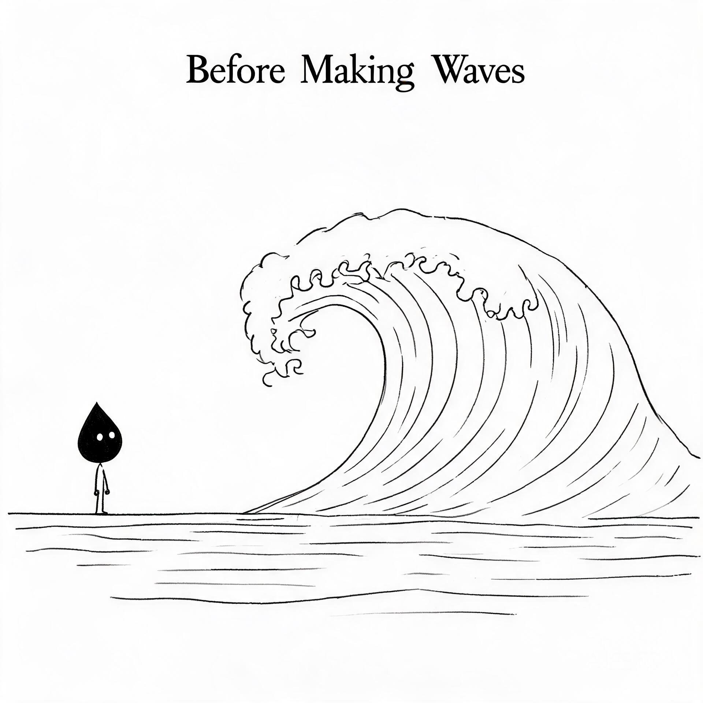
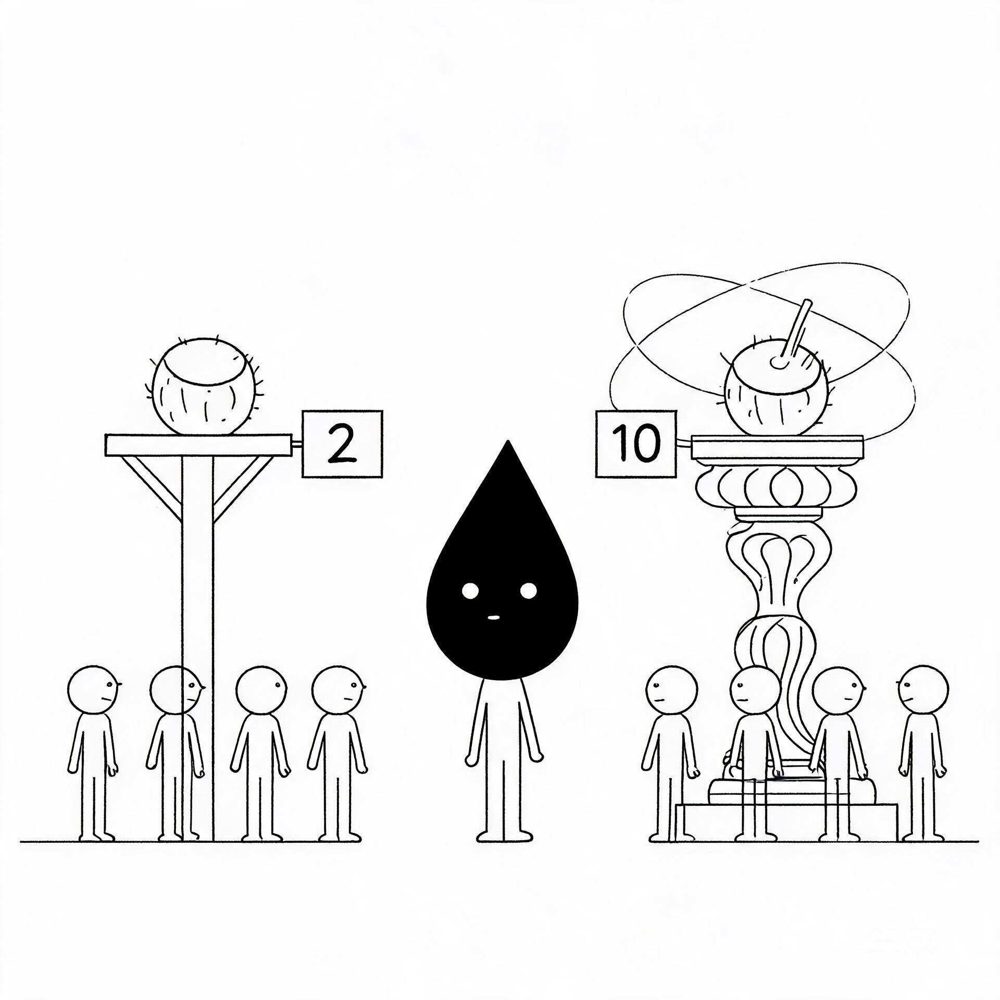
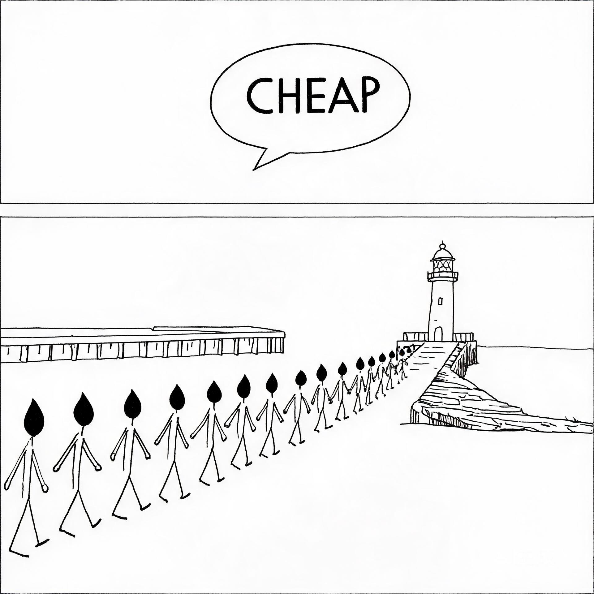

<div align="center">

# 🌊 掀起巨浪

## 新人看懂行业的16堂课

<br>



<br>

### *通过珊瑚岛上的故事，学会看懂行业的底层逻辑*

<br>

[](https://github.com/hisunfei/Great_Wave/raw/main/掀起巨浪-新人看懂行业的16堂课.pdf)
&nbsp;
[](https://github.com/hisunfei/Great_Wave/raw/main/掀起巨浪-新人看懂行业的16堂课.epub)
&nbsp;
[](https://github.com/hisunfei/Great_Wave/raw/main/Making_Waves-16_Lessons_for_Understanding_an_Industry.epub)

<br>

[快速开始](#-快速开始) · [章节目录](#-全书目录) · [试读章节](#-试读第-1-课付费只有两种原因) · [真实案例](#-真实商业案例索引) · [速查卡](#-核心认知速查卡)

[English Version ↓](#english-version)

</div>

---

## 🤔 为什么写这本书？

> 在互联网行业，先后做过设计和产品，操盘过数亿的营收增量，也优化过放大镜才能看到的体验。写这本书，是因为我见过太多新人——包括当年的自己——拼命学技能，却因为缺少全局思考而碰壁。
>
> **如果当年的那个小子有这些观察行业的认知，相信可以掀起更大浪花。**

<br>

<table>
<tr>
<td width="50%">

### ✅ 这本书给你

- 🧠 一套完整的**行业认知框架**
- 📖 16 个**生动有趣的故事**
- 🌍 每个故事背后的**真实商业案例**
- 🎯 可直接使用的**思维模型**
- 📝 每课一句话的**核心认知总结**

</td>
<td width="50%">

### ❌ 这本书不是

- ❌ 枯燥的教科书或理论堆砌
- ❌ 成功学鸡汤或励志口号
- ❌ 只适合某个行业的专业书籍
- ❌ 需要 MBA 背景才能读懂的东西
- ❌ 告诉你"该怎么做"的操作手册

</td>
</tr>
</table>

---

## 🎯 适合谁读？

<table>
<tr>
<td align="center" width="25%">
<h3>🌱</h3>
<b>职场新人</b><br>
<sub>刚入行 1-3 年<br>想快速建立全局视野</sub>
</td>
<td align="center" width="25%">
<h3>🔄</h3>
<b>转行探索者</b><br>
<sub>想换赛道<br>不知如何判断行业好坏</sub>
</td>
<td align="center" width="25%">
<h3>💪</h3>
<b>努力但迷茫的人</b><br>
<sub>很拼却看不到全局<br>感觉在原地打转</sub>
</td>
<td align="center" width="25%">
<h3>🧠</h3>
<b>产品 / 运营 / 创业者</b><br>
<sub>需要行业思维框架<br>提升商业判断力</sub>
</td>
</tr>
</table>

---

## 🚀 快速开始

**三种方式，选一个开始：**

| 方式 | 适合 | 操作 |
|------|------|------|
| 📄 **下载 PDF** | 电脑阅读、打印标注 | [点击下载](https://github.com/hisunfei/Great_Wave/raw/main/掀起巨浪-新人看懂行业的16堂课.pdf) |
| 📚 **下载 EPUB** | Kindle / Apple Books / 微信读书 | [点击下载](https://github.com/hisunfei/Great_Wave/raw/main/掀起巨浪-新人看懂行业的16堂课.epub) |
| 👀 **在线阅读** | 先看试读章节再决定 | [往下滚动 ↓](#-试读第-1-课付费只有两种原因) |

---

## 📚 全书目录

全书分为四大部分，16 堂课，每课通过一个珊瑚岛上的故事，讲透一个行业认知的核心道理。

<br>

### 第一部分 · 看清用户

> 理解用户的真实行为，而不是他们说的话

<table>
<tr>
<td width="120" align="center">

</td>
<td>

**第 1 课 · 付费只有两种原因**

用户掏钱只有两种原因：**真实价值**（真的解决了问题）和**感知价值**（感觉问题被解决了）。两种生意，两种打法，两种天花板。

> 🏷️ 核心认知：**价值二分法** — 真实价值 vs 感知价值

</td>
</tr>
<tr>
<td align="center">

</td>
<td>

**第 2 课 · 用户嘴上说的和脚投的票是两回事**

用户说的和做的经常不一样。矛盾时，信他的脚，不信他的嘴。

> 🏷️ 核心认知：**信脚不信嘴** — 用户行为比用户调研更诚实

</td>
</tr>
<tr>
<td align="center">

</td>
<td>

**第 3 课 · 切换成本决定天花板**

用户不选你，往往不是因为你不好，而是因为换你的成本太高。

> 🏷️ 核心认知：**四绳模型** — 沉没成本、网络效应、信任惯性、学习曲线

</td>
</tr>
</table>

<br>

### 第二部分 · 看清行业

> 看懂行业的底层结构和运行规律

| 课 | 标题 | 核心认知 | 真实案例 |
|:--:|------|----------|----------|
| 04 | **价值链拆解** | 去掉你，产品还能交付吗？ | PBM 药房福利管理者、美团外卖 |
| 05 | **真实市场 vs 报告市场** | 行业报告的市场规模不是你的 | 每日优鲜的兴衰 |
| 06 | **竞争格局** | 先数牌桌上有几个人 | 美团外卖 vs 海底捞 |
| 07 | **老玩家的沉没资产** | 让他们成功的资产变成枷锁 | 柯达的数码相机 |
| 08 | **行业周期** | 顺风多出海，逆风修船等风来 | 中国移动互联网周期 |

<br>

### 第三部分 · 看清自己

> 建立独立的判断力和思考框架

| 课 | 标题 | 核心认知 | 真实案例 |
|:--:|------|----------|----------|
| 09 | **信息分类** | 事实、观点、噪音——三种信息 | 安然公司事件 |
| 10 | **第一性原理** | 剥掉共识的外壳，从事实重新推导 | Netflix 颠覆 Blockbuster |
| 11 | **归因纪律** | 成功了不代表做对了 | 基金经理任泽松 |
| 12 | **反面测试** | 最坏能扛，最好够好 | 黄太吉煎饼 |
| 13 | **最小验证** | 成本趋近于零的验证 | Dropbox 视频、Zappos 拍照 |

<br>

### 第四部分 · 看清杠杆

> 用对杠杆，让努力产生倍增效应

| 课 | 标题 | 核心认知 | 真实案例 |
|:--:|------|----------|----------|
| 14 | **能力杠杆** | 把执行交给工具，时间留给判断 | Klarna AI、Pieter Levels |
| 15 | **信息差窗口** | 供给稀缺 + 需求觉醒 + 入场成本低 | 滴滴早期司机红利 |
| 16 | **选择比努力重要** | 五年后你能带走什么？ | 大厂螺丝钉 vs 小公司全栈 |

---

## 👀 试读：第 1 课 · 付费只有两种原因

<details open>
<summary><b>点击展开完整章节 ↓</b></summary>

<br>

### 前言

阿水来珊瑚岛的第一周，就撞见了一件想不通的事。

同样的椰子，一个卖 2 鱼币，一个卖 10 鱼币。**贵的反而排队更长。** 他盯着两条队伍看了半天，脑子里只有一个念头：**这个世界，到底是怎么定价的？**

后来他想明白了——用户掏钱，归根结底只有两种原因：要么你帮他**真的解决了问题**，要么你让他**感觉问题被解决了**。前者叫真实价值，后者叫感知价值。

### 故事

码头尽头有两家椰汁摊。

第一家摊主叫阿海，皮肤晒得黝黑。他的摊位很简单：一堆新鲜椰子，一把砍刀，一块木板上写着"椰汁 2 鱼币"。干脆利落，十秒钟一单。

第二家在山坡上，摊主叫阿浪，戴着草帽，笑起来像个诗人。篝火噼啪响，尤克里里的曲子正好放到副歌，海风吹过来，椰汁被装进打磨过的海螺壳里，杯口插着一朵小黄花。木牌上写着："海螺椰汁 10 鱼币"。

> 味道和阿海的差不多。但那股"此刻我的人生还不错"的感觉，确实值多出来的 8 鱼币。

岛上的老陈总结得好：**阿海卖的是椰汁，阿浪卖的是"今晚我值得对自己好一点"。**

### 现实原型

这个故事参考了现实中的**咖啡行业**：

| | 真实价值 | 感知价值 |
|---|---|---|
| 产品 | 瓶装咖啡 15 元 | 星巴克手冲 38 元 |
| 解决的需求 | "我需要咖啡因" | "我在一个体面的空间里享受" |
| 竞争方式 | 性价比和渠道 | 体验、氛围和品牌 |

### 启示

在职场中，你是那个"解决问题"的人，还是"让人感觉问题被解决了"的人？前者容易被替代，后者需要你对业务有理解、对表达有技巧。**两种价值不是二选一，而是先后顺序。**

### 🎯 核心认知

> **价值二分法** — 用户掏钱只有两种原因：要么你帮他解决了问题（真实价值），要么你让他感觉问题被解决了（感知价值）。

</details>

<br>

---

## 🌍 真实商业案例索引

本书每个故事都有对应的真实商业案例，以下是完整索引：

| 课 | 故事主题 | 真实案例 | 关键洞察 |
|:--:|----------|----------|----------|
| 01 | 价值二分法 | 咖啡行业（瓶装 vs 星巴克） | 真实价值和感知价值是两种生意 |
| 02 | 信脚不信嘴 | 手机行业（小米 vs 苹果） | 用户调研说性价比，用脚投票选 iPhone |
| 03 | 四绳模型 | 飞书 vs 钉钉 | 不是说服老用户离开，而是在新用户被绑定前出现 |
| 04 | 价值链拆解 | PBM 药房福利、美团外卖 | 去掉你，产品还能交付吗？ |
| 05 | 四层切割 | 每日优鲜的兴衰 | 万亿市场 ≠ 你的市场 |
| 06 | 集中度分析 | 外卖（高集中度）vs 餐饮（低集中度） | 看清牌桌上有几个人 |
| 07 | 金锁链效应 | 柯达发明了数码相机却不敢转型 | 让人成功的资产变成枷锁 |
| 08 | 三信号判断 | 中国移动互联网周期 2012-2016 | 顺风多出海，逆风修船 |
| 09 | 信息三分法 | 安然公司事件 | 把管理层预测（观点）当成了事实 |
| 10 | 第一性原理 | Netflix 颠覆 Blockbuster | 用户要的不是"去店里租碟" |
| 11 | 归因三问 | 基金经理任泽松 | 2013 年超额收益是 Beta 还是 Alpha？ |
| 12 | 反面测试 | 黄太吉煎饼 | 营销热度过去，复购率只有 10% 怎么办？ |
| 13 | 最小验证 | Dropbox 视频、Zappos 拍照 | 3 分钟视频验证了需求 |
| 14 | 能力杠杆 | Klarna AI、Pieter Levels | 一个人年收入 500 万美元，零员工 |
| 15 | 窗口三条件 | 滴滴早期司机红利 | 窗口越来越短：7年→4年→几个月 |
| 16 | 可迁移性 | 大厂螺丝钉 vs 小公司全栈 | 五年后你能带走什么？ |

---

## 🃏 核心认知速查卡

> 打印这张卡片，放在桌上随时回顾 👇

```
┌─────────────────────────────────────────────────┐
│              🌊 16 个核心认知速查                 │
├─────────────────────────────────────────────────┤
│                                                  │
│  01  价值二分法    真实价值 vs 感知价值            │
│  02  信脚不信嘴    用户行为 > 用户调研              │
│  03  四绳模型      沉没成本·网络效应·信任·学习曲线  │
│  04  价值链拆解    去掉你，产品还能交付吗？          │
│  05  四层切割      报告市场 ≠ 你的真实市场          │
│  06  集中度分析    先数牌桌上有几个人               │
│  07  金锁链效应    成功的资产 → 转型的枷锁          │
│  08  三信号判断    钱·人·利润 → 判断行业周期        │
│  09  信息三分法    事实·观点·噪音                   │
│  10  第一性原理    剥掉共识，从事实重新推导          │
│  11  归因三问      不做会怎样？还有谁？再做一次？    │
│  12  反面测试      最坏能扛，最好够好               │
│  13  最小验证      成本趋近于零的验证先做            │
│  14  能力杠杆      执行交给工具，时间留给判断        │
│  15  窗口三条件    供给稀缺 + 需求觉醒 + 入场成本低  │
│  16  可迁移性      五年后你能带走什么？              │
│                                                  │
└─────────────────────────────────────────────────┘
```

---

## 📖 每课结构

```
┌──────────────────────────────────────────────┐
│  📖 前言        这一课要讲什么，一两段话说清  │
│  📖 故事        珊瑚岛上的寓言（80% 篇幅）    │
│  🌍 现实原型    故事背后的真实商业案例         │
│  💡 启示        映射到真实职场场景             │
│  🎯 笔记        一句话核心认知                 │
└──────────────────────────────────────────────┘
```

---

## 📥 下载

| 格式 | 语言 | 文件大小 | 适用场景 | 下载 |
|------|------|---------|---------|------|
| 📄 PDF | 🇨🇳 中文 | 5.9 MB | 打印、电脑阅读、标注 | [下载](https://github.com/hisunfei/Great_Wave/raw/main/掀起巨浪-新人看懂行业的16堂课.pdf) |
| 📚 EPUB | 🇨🇳 中文 | 71 KB | Kindle、Apple Books、微信读书 | [下载](https://github.com/hisunfei/Great_Wave/raw/main/掀起巨浪-新人看懂行业的16堂课.epub) |
| 📖 EPUB | 🇬🇧 English | 78 KB | All e-readers, tablets, phones | [Download](https://github.com/hisunfei/Great_Wave/raw/main/Making_Waves-16_Lessons_for_Understanding_an_Industry.epub) |

---

## 👨‍💻 关于作者

**孙飞**，互联网产品人。

做过大厂前沿产品，经营过小作坊，操盘过数亿的营收增量项目，也优化过放大镜才能看到的体验问题。

回首望来，希望能为新入行的伙伴提供一些帮助。

📧 **Email**: [270396358@qq.com](mailto:270396358@qq.com)
&nbsp;·&nbsp;
💼 **GitHub**: [@hisunfei](https://github.com/hisunfei)

---

## 🤝 支持这个项目

如果这本书对你有帮助：

<table>
<tr>
<td align="center" width="25%">
<h3>⭐</h3>
<b>Star</b><br>
<sub>让更多人看到</sub>
</td>
<td align="center" width="25%">
<h3>📢</h3>
<b>分享</b><br>
<sub>推荐给朋友和同事</sub>
</td>
<td align="center" width="25%">
<h3>💬</h3>
<b>反馈</b><br>
<sub>通过 Issue 提建议</sub>
</td>
<td align="center" width="25%">
<h3>🔄</h3>
<b>贡献</b><br>
<sub>翻译、校对、改进</sub>
</td>
</tr>
</table>

---

## 📜 版权

© 2024 孙飞. All rights reserved.

- ✅ 复制、分发时请标注来源
- ⚠️ 未经作者书面许可请勿用于商业目的
- 💡 欢迎基于本书内容进行学习和讨论

---

<div align="center">

### English Version

<br>

**Making Waves: 16 Lessons for Understanding an Industry**

A practical guide for newcomers to understand the underlying logic of any industry, told through 16 stories set on Coral Island.

| Part | Lessons | What You'll Learn |
|------|---------|-------------------|
| See Users | 1-3 | Why users pay, real vs. perceived value, switching costs |
| See Industries | 4-8 | Value chains, market sizing, competition, industry cycles |
| See Yourself | 9-13 | Information literacy, first principles, inverse testing |
| See Leverage | 14-16 | Capability leverage, timing, career choices |

[📖 Download English EPUB →](https://github.com/hisunfei/Great_Wave/raw/main/Making_Waves-16_Lessons_for_Understanding_an_Industry.epub)

<br>

---

**如果这本书对你有帮助，请给它一个 ⭐ Star！**

[⬆️ 返回顶部](#-掀起巨浪)

</div>
