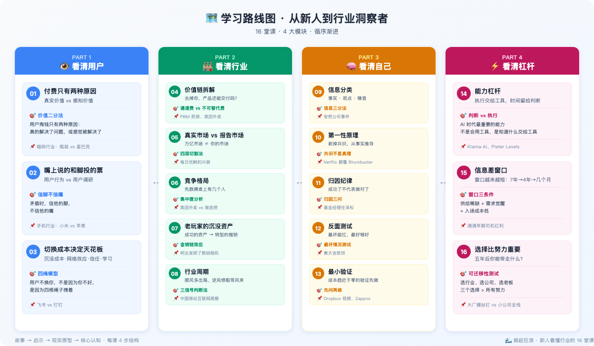
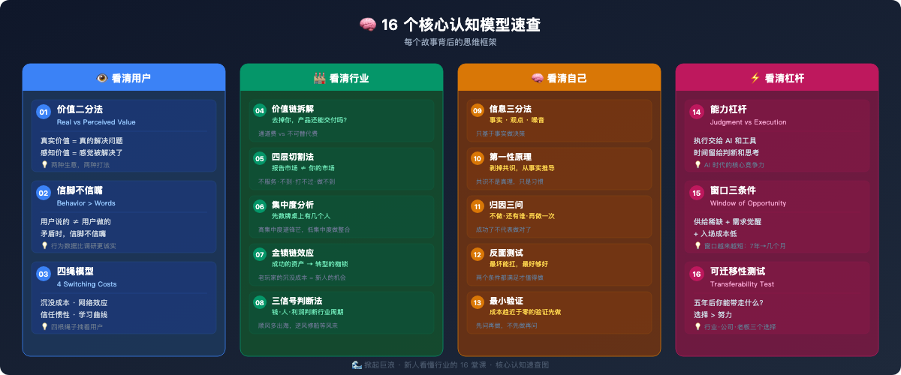

<div align="right">

**[English](README_EN.md)** | 中文

</div>

<div align="center">


<br>

[](https://github.com/hisunfei/Great_Wave/raw/main/掀起巨浪-新人看懂行业的16堂课.pdf)
[](https://github.com/hisunfei/Great_Wave/raw/main/掀起巨浪-新人看懂行业的16堂课.epub)
[](https://github.com/hisunfei/Great_Wave/raw/main/Making_Waves-16_Lessons_for_Understanding_an_Industry.epub)

</div>

---

## 📖 关于这本书

> 在互联网行业，先后做过设计和产品，操盘过数亿的营收增量，也优化过放大镜才能看到的体验。写这本书，是因为我见过太多新人——包括当年的自己——拼命学技能，却因为缺少全局思考而碰壁。如果当年的那个小子有这些观察行业的认知，相信可以掀起更大浪花。

这是一本写给职场新人的**行业认知指南**。通过一个年轻人在珊瑚岛上的 16 段经历，讲述如何看懂一个行业的底层逻辑。

**没有枯燥的理论，没有复杂的模型，只有生动的故事和可验证的真实案例。**

## 🎯 适合谁读？

- 🌱 刚入职场 1-3 年的新人
- 🔄 想要转行但不知道如何判断行业的人
- 💪 觉得自己很努力但看不到全局的人
- 🧠 想要建立行业思维框架的产品经理、运营、创业者

---

## 🗺️ 学习路线图



全书分为四个部分，循序渐进地帮你建立行业认知框架：

1. **👁️ 看清用户** - 理解用户的真实行为和付费逻辑
2. **🏭 看清行业** - 掌握行业分析的核心工具
3. **🧠 看清自己** - 建立独立的判断力和思考框架
4. **⚡ 看清杠杆** - 找到放大努力的关键支点

---

## 📚 完整目录

<details open>
<summary><h3>第一部分：看清用户（3 课）</h3></summary>

理解用户为什么付费，识别真实需求与表面需求的差异，掌握切换成本的核心逻辑。

| 课程 | 标题 | 核心认知 |
|------|------|----------|
| 01 | [付费只有两种原因](#第-1-课付费只有两种原因) | 真实价值 vs 感知价值 |
| 02 | [用户嘴上说的和脚投的票是两回事](#第-2-课用户嘴上说的和脚投的票是两回事) | 信脚不信嘴 |
| 03 | [切换成本决定天花板](#第-3-课切换成本决定天花板) | 四绳模型 |

</details>

<details open>
<summary><h3>第二部分：看清行业（5 课）</h3></summary>

拆解价值链、识别真实市场规模、分析竞争格局、理解老玩家的沉没资产、判断行业周期。

| 课程 | 标题 | 核心认知 |
|------|------|----------|
| 04 | [价值链拆解](#第-4-课价值链拆解) | 去掉你，产品还能交付吗？ |
| 05 | [真实市场 vs 报告市场](#第-5-课真实市场-vs-报告市场) | 四层切割法 |
| 06 | [竞争格局](#第-6-课竞争格局) | 集中度分析 |
| 07 | [老玩家的沉没资产](#第-7-课老玩家的沉没资产) | 金锁链效应 |
| 08 | [行业周期](#第-8-课行业周期) | 三信号判断法 |

</details>

<details open>
<summary><h3>第三部分：看清自己（5 课）</h3></summary>

建立信息分类能力、掌握第一性原理、培养归因纪律、学会反面测试、最小化验证假设。

| 课程 | 标题 | 核心认知 |
|------|------|----------|
| 09 | [信息分类](#第-9-课信息分类) | 信息三分法 |
| 10 | [第一性原理](#第-10-课第一性原理) | 剥掉共识的外壳 |
| 11 | [归因纪律](#第-11-课归因纪律) | 归因三问 |
| 12 | [反面测试](#第-12-课反面测试) | 最坏能扛，最好够好 |
| 13 | [最小验证](#第-13-课最小验证) | 成本趋近于零的验证 |

</details>

<details open>
<summary><h3>第四部分：看清杠杆（3 课）</h3></summary>

理解能力杠杆的本质、把握信息差窗口、做出比努力更重要的选择。

| 课程 | 标题 | 核心认知 |
|------|------|----------|
| 14 | [能力杠杆](#第-14-课能力杠杆) | 判断 vs 执行 |
| 15 | [信息差窗口](#第-15-课信息差窗口) | 窗口三条件 |
| 16 | [选择比努力重要](#第-16-课选择比努力重要) | 可迁移性测试 |

</details>

---

## 🧠 16 个核心认知模型



每个故事背后都有一个可复用的思维框架，帮你快速建立行业洞察力。

---

## 📝 每课结构

每一课都包含四个部分：

```
📖 故事        → 珊瑚岛上的寓言，生动有趣
💡 启示        → 将故事映射到真实的职场场景
🌍 现实原型    → 指出故事背后的真实商业案例
🎯 一句话总结  → 提炼核心认知，便于记忆
```

## 📖 阅读方式

你可以：

- **系统学习**：按顺序从头读到尾，系统建立行业认知框架
- **按需查阅**：跳到你最关心的章节，快速解决当下的困惑
- **定期反思**：把"一句话总结"当作每日反思清单，定期回顾

## 📥 下载格式

| 格式 | 语言 | 适用场景 | 下载链接 |
|------|------|----------|----------|
| 📄 PDF | 中文 | 打印、电脑阅读 | [下载 PDF](https://github.com/hisunfei/Great_Wave/raw/main/掀起巨浪-新人看懂行业的16堂课.pdf) |
| 📚 EPUB | 中文 | Kindle、Apple Books 等电子阅读器 | [下载 EPUB](https://github.com/hisunfei/Great_Wave/raw/main/掀起巨浪-新人看懂行业的16堂课.epub) |
| 📖 EPUB | English | E-readers, tablets, phones | [Download EPUB](https://github.com/hisunfei/Great_Wave/raw/main/Making_Waves-16_Lessons_for_Understanding_an_Industry.epub) |

---

## 🌟 精选章节预览

### 第 1 课：付费只有两种原因

> 用户掏钱，归根结底只有两种原因：要么你帮他**真的解决了问题**，要么你让他**感觉问题被解决了**。

**现实原型**：瓶装咖啡 15 元 vs 星巴克手冲 38 元

[📖 在 EPUB 中阅读完整故事 →](https://github.com/hisunfei/Great_Wave/raw/main/掀起巨浪-新人看懂行业的16堂课.epub)

### 第 13 课：最小验证

> **成本趋近于零的验证，永远在花钱之前做。** 一个假页面、一段视频、十杯试喝，可能帮你省下一年的弯路。

**现实原型**：Dropbox 用三分钟视频验证需求，Zappos 用去鞋店拍照的方式起步

[📖 在 EPUB 中阅读完整故事 →](https://github.com/hisunfei/Great_Wave/raw/main/掀起巨浪-新人看懂行业的16堂课.epub)

---

## 👨‍💻 关于作者

**孙飞**，互联网产品人。做过大厂前沿产品，经营过小作坊，操盘过数亿的营收增量项目，也优化过放大镜才能看到的体验问题。回首望来，希望能为新入行的伙伴提供一些帮助。

📧 **Email**: [270396358@qq.com](mailto:270396358@qq.com)  
💼 **GitHub**: [@hisunfei](https://github.com/hisunfei)

---

## 🤝 如何支持这个项目

如果这本书对你有帮助，你可以：

- ⭐ **Star** 这个仓库，让更多人看到
- 📢 **分享**给你的朋友和同事
- 💬 **反馈**你的阅读体验和建议
- 🔄 **贡献**翻译、校对或其他改进

---

## 📜 版权说明

© 2024 孙飞. All rights reserved.

- ✅ 复制、分发时请标注来源
- ⚠️ 未经作者书面许可请勿用于商业目的
- 💡 欢迎基于本书内容进行学习和讨论

---

<div align="center">

**如果这本书对你有帮助，请给它一个 ⭐ Star！**

[⬆️ 返回顶部](#-掀起巨浪新人看懂行业的16堂课)

**Made with ❤️ by Sun Fei**

</div>
